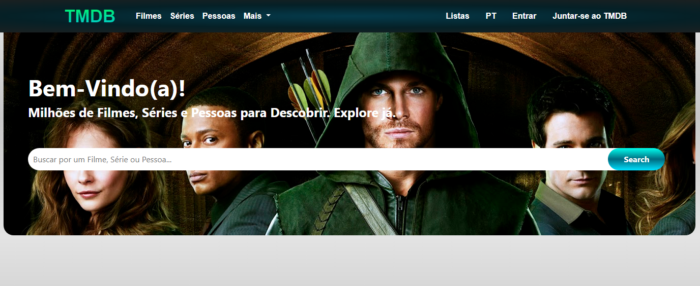

# Desafio de Typescript na plataforma DIO
  
O objetivo desse repositório é mostrar as resoluções do desafio 4 de typescript.

Consumindo a api do https://www.themoviedb.org/

## Falta finalizar 

#### Página de loguin
#### Página de listas
#### Colocar os filmes mais populares na página inicial 
#### Ajustar o footer
#### Mover o resultado da consulta para a página buscas 
#### Ajustar a responsividade

# Rodando o projeto

### Utilize o `npm install` para instalar as dependências.
### Utilize o `npm run dev` para iniciar o servidor
